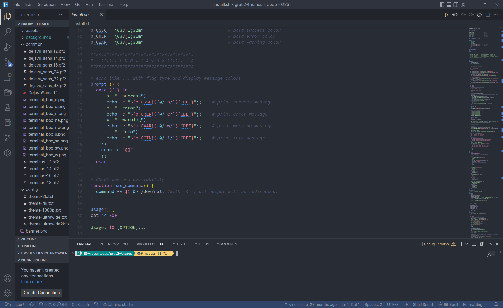
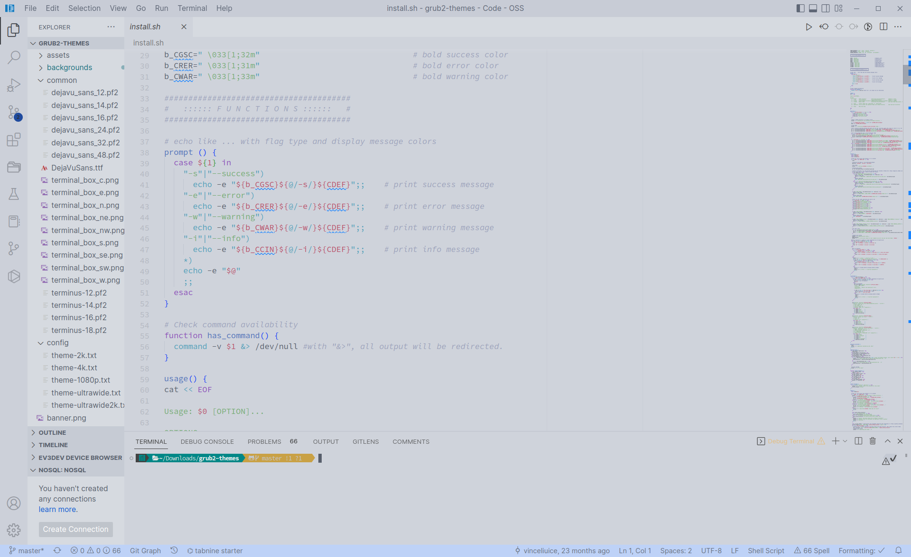

# [aclear colour theme](https://marketplace.visualstudio.com/items?itemName=andrewaclear.aclear)

> by Andrew D'Amario, © August 2022

A clean and modern dark and light VScode theme with soft fresh colours.

## Screenshots

**aclear-dark**

**aclear-light** (parsed from dark theme)

###### Credits: Initial code taken from  [Tokyo Night](https://github.com/enkia/tokyo-night-vscode-theme).
